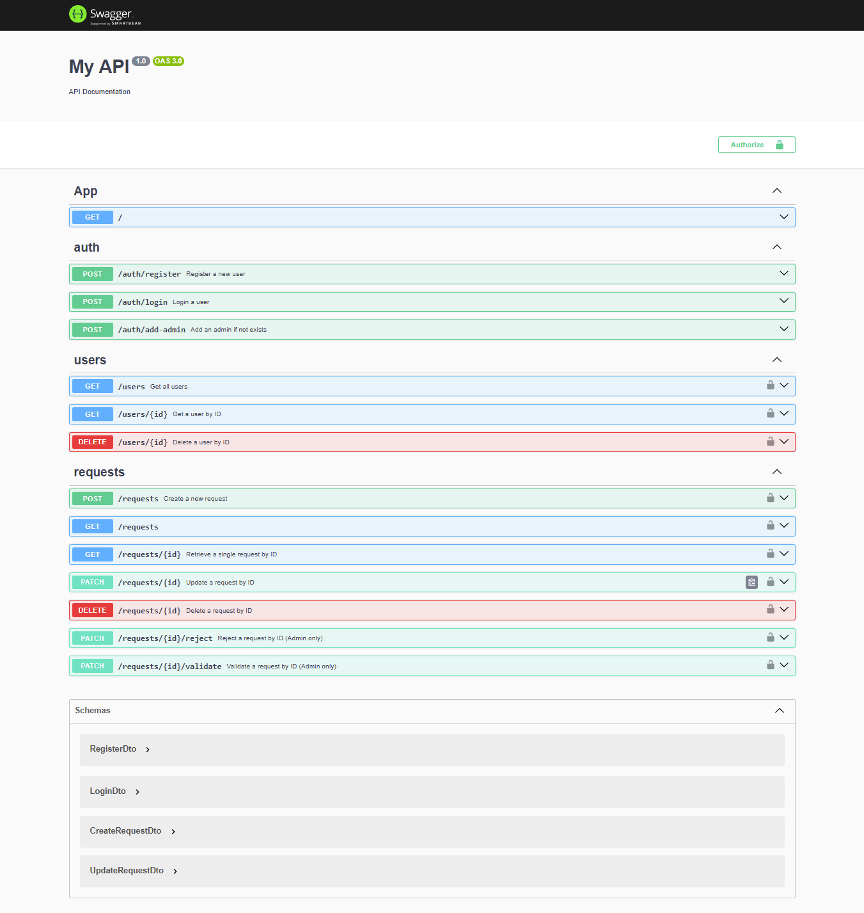

# Enterprise Help Desk Solution – Backend

This is the **backend API** for the **Enterprise Help Desk Solution**, built using **NestJS**, **TypeORM**, and **PostgreSQL**.  
It supports authentication, real-time WebSocket notifications, and flexible role-based access control.

---

## 🚀 Features

- 🔐 JWT Authentication with multi-role support
- 🧑‍🤝‍🧑 Role-based Access Control (RBAC)
- ⚔️ AuthGuard & RoleGuard using NestJS decorators
- 🔔 WebSocket notifications with NestJS Gateway
- 🗃 PostgreSQL integration via TypeORM
- 📦 Modular architecture with common utilities

---

## 🧱 Project Structure

```
src/
├── auth/                # Authentication logic (JWT, login)
│   ├── auth.module.ts
│   ├── auth.service.ts
│   └── jwt.strategy.ts
    └─  jwt-payload.interface
    └─  auth.controller.ts // that contains register , login endpoints
├── common/              # Shared decorators and guards
│   ├── roles.decorator.ts
│   └── roles.guard.ts
├── notifications/       # WebSocket real-time updates
│   ├── notifications.gateway.ts
│   └── notifications.module.ts
├── requests/            # Help desk request/ticket logic
│   ├── requests.module.ts
│   ├── requests.controller.ts
│   └── requests.service.ts
├── users/               # User management with roles
│   ├── user.entity.ts
│   ├── users.module.ts
│   └── users.service.ts

├── main.ts              # App bootstrap
```

---

## 🧑‍🏫 Role-Based Access Control (RBAC)

Each user can have **multiple roles**, represented as an array in the user entity:

```ts
@Entity()
export class User {
  @PrimaryGeneratedColumn()
  id: number;
//  other fields
  @Column("text", { array: true, default: ['user'] })
  roles: string[];
}
```


### Use roles in route guards

Use the `@Roles()` decorator and the `RolesGuard` from `common/`:

```ts
@ApiTags('requests') // Group the endpoints under the "requests" tag in Swagger
@ApiBearerAuth() // Indicate that these endpoints require a Bearer token
@Controller('requests')
@UseGuards(AuthGuard('jwt'))  // defined in the  jwt.strategy 
```

---

## 🔐 Authentication

- JWT-based login
- `JwtStrategy` configured via Passport
- Protected endpoints use `JwtAuthGuard`

---
## API Documentation

The API documentation for this project can be accessed via Swagger at the `/doc` route. Here is a preview:



## 🔔 Real-Time Notifications

WebSocket events are broadcasted using `Socket.IO` via NestJS Gateway:


---

## ⚙️ Environment Variables

Example `.env`:

```env
DATABASE_HOST=localhost
DATABASE_PORT=5432
DATABASE_USER=postgres
DATABASE_PASSWORD=yourpassword
DATABASE_NAME=helpdesk
JWT_SECRET=your_jwt_secret
JWT_EXPIRES_IN=3600s
```

---

## 🛠 Getting Started

1. **Install dependencies**
   ```bash
   npm install
   ```

2. **Run database migrations (if any)**

3. **Start dev server**
   ```bash
   npm run start:dev
   ```

4. **API runs at** `http://localhost:5000`

---

## 🧪 Dependencies

- `@nestjs/core`, `@nestjs/common`
- `@nestjs/typeorm`, `jest`
- `@nestjs/jwt`, `passport-jwt`
- `@nestjs/websockets`, `socket.io`

---
## Testing : using Jest
## 📄 License

MIT
